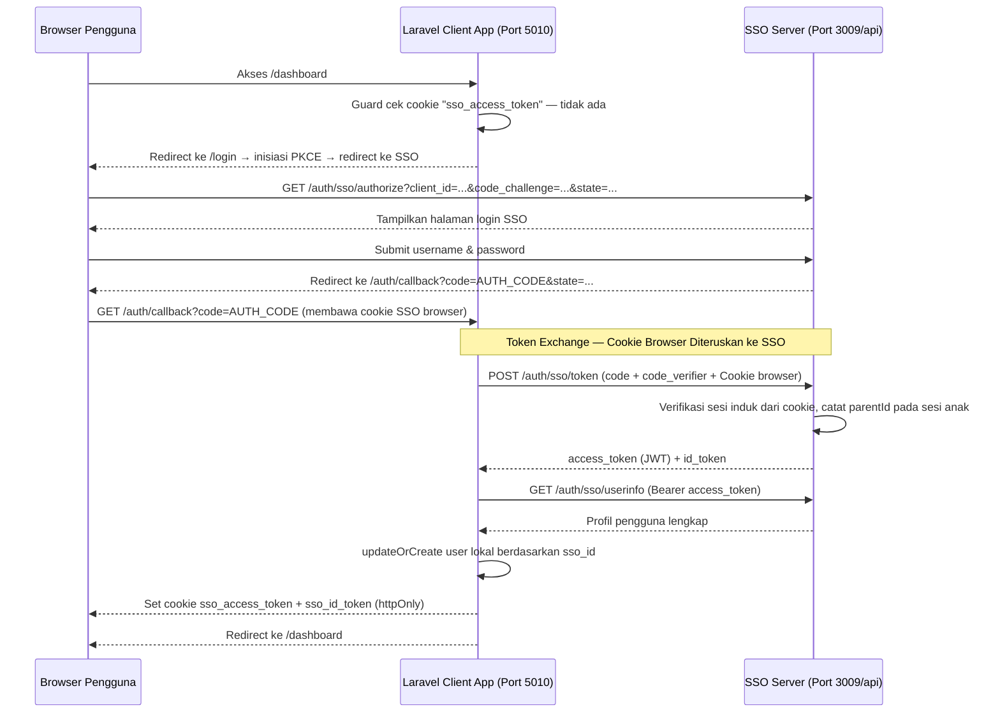

# MualliminID — Laravel SSO Client (SSR)

Aplikasi ini merupakan implementasi Client App berbasis **Laravel 13 (PHP 8.3+)** yang terintegrasi secara **Stateless** dengan sistem Single Sign-On (SSO) **MualliminID**.

Berbeda dengan integrasi OIDC tradisional yang membuat sesi stateful di server, aplikasi ini mengadopsi arsitektur **Stateless Child Session** — status sesi lokal terikat sepenuhnya di bawah kendali Sesi SSO Pusat melalui JWT yang disimpan langsung di cookie browser. Backend Laravel tidak menyimpan session apapun untuk autentikasi.

---

## 1. Tech Stack & Dependensi Utama

| Komponen | Detail |
| :--- | :--- |
| Framework | Laravel 13 (`^13.8`) |
| PHP | >= 8.3 |
| Reactivity Engine | Laravel Livewire v4+ |
| Styling & UI | Tailwind CSS v4 (sudut kaku `border-radius: 0`) |
| Database | SQLite (replikasi profil pengguna dari SSO) |
| Autentikasi | OAuth 2.0 Authorization Code + PKCE, JWT RS256 |

---

## 2. Arsitektur & Alur Autentikasi

Aplikasi ini mengimplementasikan konsep **Stateless Child Session**. Sesi autentikasi tidak menggunakan tabel `sessions` lokal — setiap request divalidasi terhadap JWT `access_token` yang diterbitkan oleh SSO pusat dan disimpan sebagai **httpOnly cookie** di browser.

### Diagram Alur Login (OIDC + PKCE + Cookie Forwarding)



### Mekanisme Auto-Refresh Token (Cookie Proxying)

Saat guard mendeteksi `access_token` kedaluwarsa, ia **tidak** meminta user login ulang. Sebaliknya, guard meneruskan (`proxy`) header `Cookie` dari browser pengguna ke SSO pusat:

```
Browser → Laravel (request dengan Cookie browser)
                ↓
       Guard membaca Cookie header
                ↓
Laravel → SSO: POST /auth/sso/token
          Headers: Cookie: {CLIENT_ID}_refresh_token=...
          Body: { grant_type: "refresh_token", client_id: ..., client_secret: ... }
                ↓
SSO memverifikasi refresh token dari cookie → terbitkan access_token baru
                ↓
Laravel: verifikasi signature token baru → set cookie baru → lanjutkan request
```

Refresh token **tidak pernah menyentuh** kode aplikasi secara eksplisit — ia tersimpan sebagai httpOnly cookie browser dan diteruskan otomatis oleh server ke SSO.

### Mekanisme Single Logout

Bila pengguna logout dari portal SSO pusat, sesi induk menjadi tidak aktif. Saat guard mencoba me-refresh token di request berikutnya, SSO membalas dengan `PARENT_SESSION_INACTIVE`. Guard langsung menghapus cookie dan mengembalikan `null` — pengguna otomatis diarahkan ke halaman login.

---

## 3. Peta Rute Aplikasi

| Method | URL | Handler | Middleware | Keterangan |
| :--- | :--- | :--- | :--- | :--- |
| GET | `/` | View `login` | — | Halaman landing, redirect ke login |
| GET | `/login` | `SSOController@redirectToSSO` | — | Inisiasi PKCE, redirect ke SSO |
| GET | `/auth/callback` | `SSOController@handleCallback` | — | Terima code dari SSO, tukar token |
| POST | `/logout` | `SSOController@logout` | `auth` | End session SSO + hapus cookie |
| GET | `/dashboard` | `DashboardController@index` | `auth` | Halaman utama (dilindungi guard) |

---

## 4. Panduan Setup & Instalasi

### 4.1. Prasyarat

- PHP >= 8.3 + ekstensi `php_sqlite3`
- Composer
- Node.js (v18+) & NPM

### 4.2. Instalasi Dependensi

```bash
composer install
npm install
```

### 4.3. Konfigurasi Environment

```bash
copy .env.example .env
php artisan key:generate
```

Sesuaikan variabel berikut di dalam `.env`:

```env
SERVER_PORT=5010
APP_URL=http://localhost:5010

SSO_API_URL=http://localhost:3009/api
SSO_CLIENT_ID=app_xxxxxxxxxxxxxxxx
SSO_CLIENT_SECRET=secret_xxxxxxxxxxxxxxxx
SSO_PUBLIC_KEY_PATH=keys/public.pem
```

| Variabel | Keterangan | Digunakan di |
| :--- | :--- | :--- |
| `SSO_API_URL` | Base URL API server MualliminID SSO | Guard (refresh), SSOController (authorize, token, userinfo), UserManagement (sync) |
| `SSO_CLIENT_ID` | Client ID aplikasi yang terdaftar di SSO | SSOController (semua request), UserManagement (path sync) |
| `SSO_CLIENT_SECRET` | Secret untuk token exchange & sync pengguna | SSOController (callback), AppServiceProvider (refresh), UserManagement (X-Client-Secret) |
| `SSO_PUBLIC_KEY_PATH` | Path ke `public.pem` relatif dari root project | Guard — verifikasi tanda tangan JWT secara offline |

### 4.4. Mendapatkan File `keys/public.pem`

Folder `keys/` tidak ikut ter-commit ke Git (ada di `.gitignore`). Anda perlu membuat folder dan menyalin kunci publik RSA dari server SSO secara manual:

```bash
mkdir keys
```

Salin file `public.pem` dari administrator SSO ke `keys/public.pem`. Alternatifnya, unduh public key via endpoint JWKS SSO:

```
GET {SSO_API_URL}/../.well-known/jwks.json
```

> Tanpa file `keys/public.pem`, seluruh request autentikasi akan gagal karena guard tidak dapat memverifikasi tanda tangan JWT.

### 4.5. Migrasi Database

```bash
copy NUL database\database.sqlite
php artisan migrate
```

---

## 5. Cara Menjalankan Aplikasi

### Opsi A: Development (Rekomendasi)

Menjalankan semua proses secara bersamaan menggunakan Concurrently:

```bash
composer run dev
```

Perintah ini menjalankan empat proses paralel:
- `php artisan serve` — Laravel development server di port 5010
- `php artisan queue:listen` — Queue listener untuk job sinkronisasi
- `php artisan pail` — Real-time log viewer
- `npm run dev` — Vite dev server untuk hot-reload Tailwind CSS

### Opsi B: Production Build

```bash
npm run build
php artisan serve
```

---

## 6. Peta Integrasi Kode (Code Integration Map)

### `config/auth.php`

Mengubah driver guard `web` dari `session` bawaan Laravel ke driver custom stateless `sso-token`:

```php
'guards' => [
    'web' => [
        'driver'   => 'sso-token',
        'provider' => 'users',
    ],
],
```

### `app/Providers/AppServiceProvider.php`

Jantung dari **Stateless Child Session**. Mendaftarkan guard `sso-token` via `Auth::viaRequest`:

1. Baca `sso_access_token` dari cookie browser.
2. Verifikasi tanda tangan JWT menggunakan `openssl_verify` + `keys/public.pem`.
3. Decode payload → ekstrak `ssoId` dan `exp`.
4. Jika token kedaluwarsa → kirim request refresh ke SSO dengan meneruskan Cookie browser (server-side cookie proxying) → **verifikasi tanda tangan token baru** → set cookie baru.
5. Return `User::where('sso_id', $ssoId)->first()`.

### `app/Http/Controllers/Auth/SSOController.php`

- `redirectToSSO()`: Generate PKCE (`code_challenge` SHA-256), simpan `code_verifier` dan `state` ke session, redirect browser ke SSO authorize endpoint.
- `handleCallback()`: Validasi `state` CSRF, tukar `code` ke token dengan meneruskan Cookie browser, ambil profil via userinfo, `updateOrCreate` user lokal, set cookie httpOnly.
- `logout()`: Panggil SSO `end_session`, hapus cookie `sso_access_token` dan `sso_id_token`.

### `routes/web.php`

Mendefinisikan rute otentikasi. Middleware `auth` secara otomatis memanggil guard `sso-token` untuk memvalidasi setiap request yang masuk ke `/dashboard` dan `/logout`.

### `app/Livewire/UserManagement.php` & `livewire/user-management.blade.php`

Komponen Livewire untuk manajemen data pengguna di dashboard:

- Menghitung statistik user secara real-time (`total`, `synced`, `no_role`).
- Sinkronisasi data pengguna dari API SSO menggunakan header `X-Client-Secret` (komunikasi antar-server).
- Render tabel data dengan loading overlay reaktif (`wire:loading`).
- Pagination asinkron tanpa reload halaman penuh.

### `keys/public.pem`

RSA Public Key dari SSO untuk verifikasi offline tanda tangan JWT. Tidak pernah ter-commit ke Git. Harus disalin secara manual setelah clone.

---

## 7. Komunikasi Aplikasi ke SSO Server

Aplikasi memanggil enam titik SSO. Tiga dipanggil oleh browser (redirect), tiga lainnya dipanggil oleh server Laravel secara langsung.

---

### 1. `GET /auth/sso/authorize` — Inisiasi Login PKCE

**Dipanggil dari**: `SSOController::redirectToSSO()` — browser diredirect ke URL ini.

```
GET {SSO_API_URL}/auth/sso/authorize
  ?client_id=app_xxxx
  &redirect_uri=http://localhost:5010/auth/callback
  &response_type=code
  &scope=openid profile email
  &state={uuid_random}
  &code_challenge={sha256_base64url_dari_verifier}
  &code_challenge_method=S256
```

SSO menampilkan halaman login, lalu setelah berhasil redirect browser ke `/auth/callback?code=...&state=...`.

---

### 2. `POST /auth/sso/token` — Tukar Authorization Code → Token

**Dipanggil dari**: `SSOController::handleCallback()` — server-to-server dengan cookie browser diteruskan.

```http
POST {SSO_API_URL}/auth/sso/token
Content-Type: application/json
Cookie: {cookie_browser_yang_diteruskan}

{
  "grant_type":    "authorization_code",
  "client_id":     "app_xxxx",
  "client_secret": "secret_xxxx",
  "code":          "{authorization_code_dari_URL}",
  "redirect_uri":  "http://localhost:5010/auth/callback",
  "code_verifier": "{verifier_dari_session}"
}
```

**Response dari SSO (200):**

```json
{
  "message": "Token berhasil diterbitkan",
  "data": {
    "access_token": "eyJhbGciOiJSUzI1NiJ9...",
    "id_token":     "eyJhbGciOiJSUzI1NiJ9...",
    "token_type":   "Bearer",
    "expires_in":   900,
    "client_id":    "app_xxxx"
  }
}
```

> SSO secara otomatis meng-set cookie httpOnly `{CLIENT_ID}_refresh_token` ke browser pengguna. Cookie inilah yang digunakan untuk refresh token di tahap berikutnya.

---

### 3. `GET /auth/sso/userinfo` — Ambil Profil Pengguna

**Dipanggil dari**: `SSOController::handleCallback()`, setelah token berhasil didapat.

```http
GET {SSO_API_URL}/auth/sso/userinfo
Authorization: Bearer {access_token}
```

**Response dari SSO (200):**

```json
{
  "message": "User info berhasil didapatkan",
  "data": {
    "userId":           "usr_7f8d9a2b-3c4e-5f6a-7b8d-9e0f1a2b3c4d",
    "email":            "ahmad.fauzi@muallimin.sch.id",
    "email_verified":   true,
    "name":             "Ahmad Fauzi",
    "first_name":       "Ahmad",
    "last_name":        "Fauzi",
    "picture":          "https://sso.muallimin.sch.id/api/uploads/profiles/usr_7f8.webp",
    "whatsapp_number":  "6281234567890",
    "nbm":              123456,
    "role":             "GURU",
    "status":           "ACTIVE",
    "sessionId":        "sess_child_uuid"
  }
}
```

Data yang disimpan ke database lokal: `sso_id` (dari JWT payload), `name`, `email`, `nbm`, `whatsapp_number`, `role` (dari JWT payload — sudah terverifikasi kriptografis).

---

### 4. `POST /auth/sso/token` — Refresh Access Token

**Dipanggil dari**: Guard `sso-token` di `AppServiceProvider` saat `exp` token terlewati.

```http
POST {SSO_API_URL}/auth/sso/token
Content-Type: application/json
Cookie: {CLIENT_ID}_refresh_token=...  ← diteruskan dari Cookie browser pengguna

{
  "grant_type":    "refresh_token",
  "client_id":     "app_xxxx",
  "client_secret": "secret_xxxx"
}
```

**Response dari SSO (200):**

```json
{
  "message": "Token berhasil diterbitkan",
  "data": {
    "access_token": "eyJhbGciOiJSUzI1NiJ9...",
    "id_token":     "eyJhbGciOiJSUzI1NiJ9...",
    "token_type":   "Bearer",
    "expires_in":   900
  }
}
```

Guard **memverifikasi tanda tangan** token baru dengan `openssl_verify` sebelum menyimpannya ke cookie.

---

### 5. `POST /auth/sso/end_session` — Logout

**Dipanggil dari**: `SSOController::logout()`.

```http
POST {SSO_API_URL}/auth/sso/end_session
Authorization: Bearer {access_token}
Content-Type: application/json

{
  "id_token_hint": "{id_token_dari_cookie}",
  "client_id":     "app_xxxx"
}
```

**Response dari SSO (200):**

```json
{
  "message": "Logout client app berhasil"
}
```

Setelah request ini, SSO menginvalidasi sesi anak dan menghapus cookie refresh token. Laravel kemudian menghapus cookie `sso_access_token` dan `sso_id_token` dari browser.

---

### 6. `GET /client-apps/by-client-id/{CLIENT_ID}/users` — Sinkronisasi Massal

**Dipanggil dari**: `UserManagement::sync()` — saat admin menekan tombol "Sinkronkan dari SSO".

```http
GET {SSO_API_URL}/client-apps/by-client-id/{SSO_CLIENT_ID}/users?page=1&limit=100
X-Client-Secret: {SSO_CLIENT_SECRET}
```

Tidak menggunakan Bearer Token — komunikasi antar-server murni menggunakan `X-Client-Secret`. SSO memverifikasi secret ini dengan bcrypt.

**Response dari SSO (per halaman, 200):**

```json
{
  "status": "success",
  "message": "Daftar user aplikasi berhasil didapatkan",
  "data": [
    {
      "userId":           "usr_7f8d9a2b-...",
      "email":            "ahmad.fauzi@muallimin.sch.id",
      "name":             "Ahmad Fauzi",
      "first_name":       "Ahmad",
      "last_name":        "Fauzi",
      "whatsapp_number":  "6281234567890",
      "nbm":              "20240001",
      "role":             "GURU",
      "status":           "ACTIVE"
    }
  ],
  "meta": {
    "total":      285,
    "page":       1,
    "limit":      100,
    "totalPages": 3
  }
}
```

Guard melakukan loop `do-while` dari halaman 1 hingga `totalPages`. Setelah semua halaman selesai, user lokal yang ber-`sso_id` namun tidak ada dalam daftar SSO akan **dihapus otomatis** (kecuali yang `role = ADMIN`).

---

## 8. Model User Lokal

File: [`app/Models/User.php`](app/Models/User.php)

| Kolom | Tipe | Nullable | Unique | Keterangan |
| :--- | :--- | :--- | :--- | :--- |
| `id` | bigint | Tidak | Ya | Primary key lokal |
| `sso_id` | uuid | Ya | Ya | `userId` dari JWT/userinfo SSO — penghubung akun SSO ke akun lokal |
| `name` | string | Tidak | Tidak | Nama lengkap |
| `email` | string | Tidak | Ya | Email — kunci fallback sebelum `sso_id` ada |
| `email_verified_at` | timestamp | Ya | Tidak | Tidak digunakan aktif di alur SSO |
| `nbm` | string(20) | Ya | Tidak | Nomor Buku Murid |
| `whatsapp_number` | string(20) | Ya | Tidak | Nomor WhatsApp |
| `role` | string(50) | Ya | Tidak | Peran dari JWT payload SSO: `GURU`, `SISWA`, `ADMIN`, dll |
| `password` | string | Ya | Tidak | Tidak dipakai untuk login SSO — ada karena extends `Authenticatable` |

---

## 9. Masa Berlaku Token

| Token | Penyimpanan | TTL Default | Keterangan |
| :--- | :--- | :--- | :--- |
| Authorization Code | URL parameter (sekali pakai) | 5 menit | Harus segera ditukarkan, single-use |
| Access Token | Cookie httpOnly browser | 15 menit (900 detik) | Dipakai guard untuk verifikasi setiap request |
| ID Token | Cookie httpOnly browser | 15 menit | Dipakai saat `end_session` logout |
| Refresh Token | Cookie httpOnly browser (set SSO) | 24 jam | Diteruskan server ke SSO saat refresh |
| Refresh Token (Remember Me) | Cookie httpOnly browser | 7 hari | Jika pengguna memilih "Ingat Saya" di SSO |

---

## 10. Penanganan Error SSO

| HTTP Status | Pesan Error | Penyebab | Solusi |
| :--- | :--- | :--- | :--- |
| `400` | `Client tidak ditemukan` | `client_id` salah | Periksa `SSO_CLIENT_ID` di `.env` |
| `400` | `Redirect URI tidak cocok` | `redirect_uri` tidak terdaftar di SSO | Daftarkan URI yang benar ke admin SSO |
| `400` | `Code sudah digunakan` | Auth code ditukar lebih dari satu kali | Redirect ulang dari `/login` |
| `400` | `PKCE verification failed` | `code_verifier` tidak cocok dengan `code_challenge` | Pastikan verifier tersimpan di session dengan benar |
| `401` | `Client authentication failed` | `client_secret` salah | Periksa `SSO_CLIENT_SECRET` di `.env` |
| `401` | `Sesi induk tidak aktif` | Parent session di SSO sudah logout | Arahkan user login ulang ke SSO |

---

## 11. Git Safety

File-file berikut **tidak ter-commit** karena sudah masuk `.gitignore`:

```
.env           ← Berisi SSO_CLIENT_SECRET, SSO_CLIENT_ID, dan APP_KEY
/keys/         ← Berisi public.pem (kunci kriptografi RSA)
*.sqlite       ← File database lokal SQLite
*.log          ← Log runtime aplikasi
/vendor/       ← Dependensi Composer
/node_modules/
/public/build/
```

File `.env.example` **boleh** di-commit — hanya berisi template tanpa nilai sensitif.

> Jangan pernah commit `public.pem` atau `.env` ke repositori publik.
